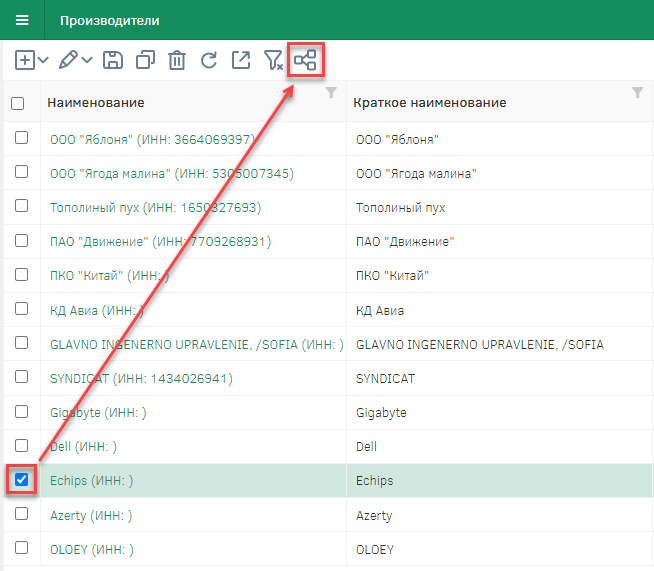
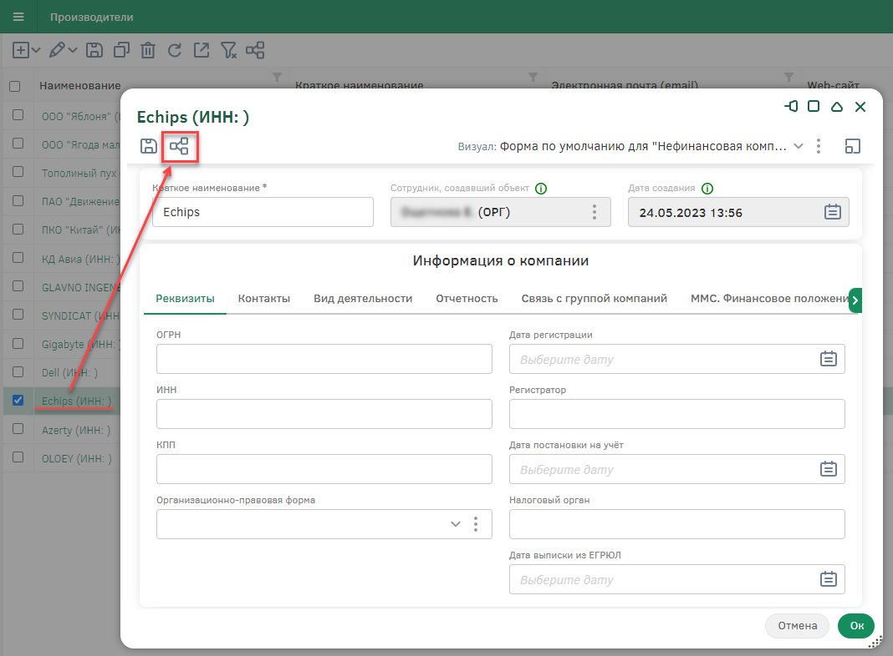
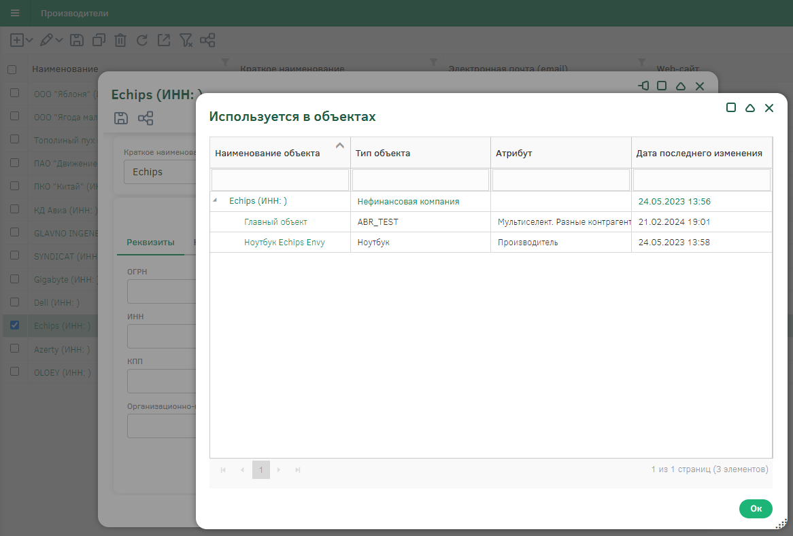
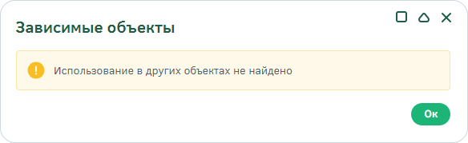

= *Зависимые объекты*

Система позволяет создавать https://docs-public.gdcloud.org/platform/ru/%D1%81%D0%BE%D0%B7%D0%B4%D0%B0%D0%BD%D0%B8%D0%B5-%D0%BD%D0%BE%D0%B2%D1%8B%D1%85-%D1%82%D0%B8%D0%BF%D0%BE%D0%B2-%D0%BE%D0%B1%D1%8A%D0%B5%D0%BA%D1%82%D0%BE%D0%B2.html[типы объектов] и https://docs-public.gdcloud.org/platform/ru/%D0%BE%D0%B1%D1%8A%D0%B5%D0%BA%D1%82%D1%8B-%D1%81%D0%B8%D1%81%D1%82%D0%B5%D0%BC%D1%8B.html[объекты] хранения информации, а
также связи между ними.

Пользователь имеет возможность просмотра списка связей (при их наличии) для текущего объекта Системы, т.е. списка *зависимых объектов*.

WARNING: Просмотр списка зависимых объектов доступен для пользователей, обладающих соответствующими https://docs-public.gdcloud.org/platform/ru/%D0%BD%D0%B0%D1%81%D1%82%D1%80%D0%BE%D0%B9%D0%BA%D0%B0-%D1%81%D0%B8%D1%81%D1%82%D0%B5%D0%BC%D0%BD%D1%8B%D1%85-%D0%BF%D1%80%D0%B0%D0%B2-%D0%B4%D0%BE%D1%81%D1%82%D1%83%D0%BF%D0%B0.html[правами].

Узнать о наличии зависимых объектов, а также просмотреть список всех связей объекта можно двумя способами.

* *1 способ.* Выбрать интересующий объект в реестре и нажать на кнопку  на панели управления.

NOTE: При наведении на кнопку  отобразится хинт «Зависимые объекты».

* *2 способ.* Открыть карточку объекта нажатием на ссылку с его наименованием. Затем в карточке объекта нажать на кнопку .

При наличии связей откроется модальное окно, в котором содержатся все объекты, ссылающиеся на текущий:

Список зависимых объектов представлен в виде таблицы со следующими полями:

[cols = "1,2" ]
|===
|*Наименование объекта* |Наименование выбранного объекта, а также связанных с ним объектов Системы
|*Тип объекта* |Тип выбранного объекта, а также связанных с ним объектов Системы
|*Атрибут* |Атрибут, с помощью которого связаны объекты Системы
|*Дата последнего изменения* |Дата изменения объекта Системы
|===

Для просмотра карточки связанного объекта необходимо нажать на ссылку с его наименованием. Карточка объекта будет открыта в новой вкладке.

В случае, если объект не связан ни с одним объектом Системы, при нажатии на кнопку  появится уведомление следующего вида:

